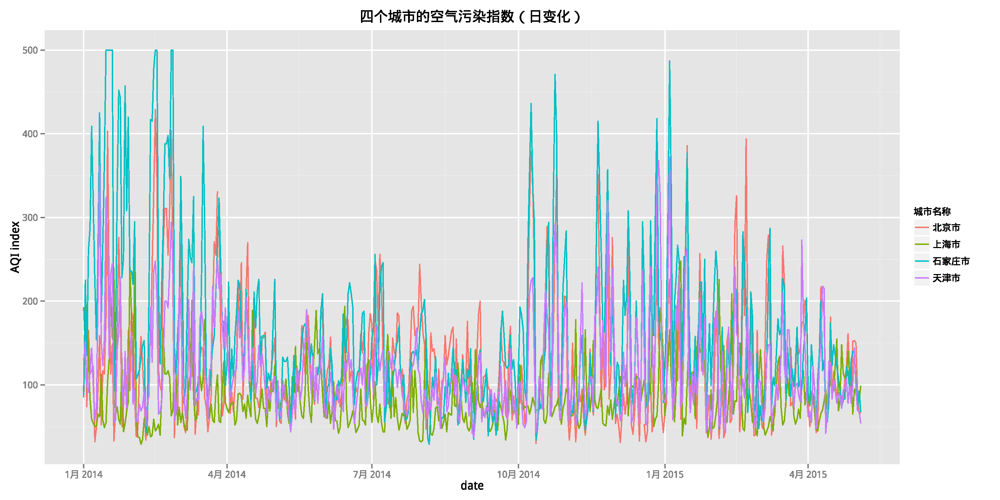
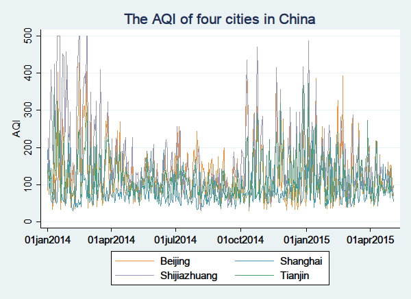

## 问题说明
本题是 Love2Share Club [半月题第一题](http://love2share.club/forum.php?mod=viewthread&tid=6&from=portal)，问题描述如下：

我们经常会碰到一些时间序列的数据，比如 GDP，CPI 等等，我们会把几个不同国家或者城市画在一张图中用以比较，本题基于我们最基本的需求，根据最原始的数据绘制时间序列的图（线图），请参考数据格式说明并绘制图形，并且满足以下要求。

附件（air_quality.csv）是四个城市（北京、天津、石家庄、上海） 2014-01-01 到 2015-05-04 的空气质量指数，数据来源：[全国城市空气质量日报](http://datacenter.mep.gov.cn/report/air_daily/air_dairy.jsp)，数据形式和说明可以参考该网站内容。

## 绘图要求

+ 绘制四个城市空气质量指数（AQI）的日变化趋势图（折线图）；
+ 根据每天的空气质量指数（AQI）计算每月平均空气质量指数（用软件实现）；
+ 绘制四个城市空气质量指数（AQI）的月变化（点线图）；
+ 绘图需要标注内容：X轴标签、Y轴标签、标题、图例；
+ 绘图的时候大家也要考虑美观！
+ （可选）能否将上面的功能整合在一起做成一个函数或者模块啥的？只需要更换数据和标注内容就能 reproduce 我们需要的线图与点图（需要考虑数据的维度，比如数据更换为 5 个国家的 GDP，这个函数或者代码仍然要能使用）。

## R 语言实现方法

    ########################################################
    ##   This file is used to plot time series line plot  ##
    ##   of Love2Share Club Half Month Problem No.1       ##
    ##   Created by: EthanDeng                            ##
    ##   Created on: 2015-05-06                           ##
    ########################################################
    setwd("D:/R/Love2ShareClub")

    # pkgs needed
    require(dplyr)
    require(ggplot2)
    require(lubridate)
    require(showtext)
    showtext.auto()

    # loading the data into R
    air_quality <- tbl_df(read.csv("air_quality.csv", head = FALSE, sep = "\"", stringsAsFactors = FALSE))
    air_quality[air_quality == ""] <- NA
    levs <- c("优","良","轻度污染","中度污染","重度污染","严重污染")

    # clean the data
    air_quality <- air_quality %>%
        select(city = V2, date = V4, index = V8, level = V12, pollutant1 = V16, pollutant2 = V18) %>%
        mutate(date = as.Date(date),
               level = factor(level, ordered = TRUE, levels = levs))

    # Method: Use ggplot2 to plot and showtext to render the Chinese Character
    # Construct the graph (base layer)
    g <- ggplot(air_quality, aes(x = date, y = index)) + geom_line(aes(colour = factor(city))) + ylab("AQI index") + theme(plot.title = element_text(lineheight=.8, face="bold",vjust=1.3)) + scale_colour_discrete(name="城市名称")
    # Add the title and print out the pdf
    g + ggtitle("四个城市的空气污染指数（日变化）")
    ggsave("air_quality.pdf")

    # To compute the monthly data from the original daily data
    air_quality_month <- air_quality %>%
        mutate(year = year(date), month = month(date)) %>%
        group_by(city,year,month) %>%
        summarise(index = mean(index,na.rm = TRUE)) %>%
        filter(index > 0) %>%
        mutate(month = sprintf("%02d",month),
                date = as.Date(paste(year,month,"01",sep="-")))

    # Just change the data, modify the title, add the point on the graph
    g %+% air_quality_month + ggtitle("四个城市的空气污染指数（月变化）") + scale_y_continuous(limits=c(0, 350)) + geom_point(aes(colour = factor(city)))
    ggsave("air_quality_month.pdf")

### 绘图效果

### Stata 实现方法

    *********************************************
    -                                           *
    -       This file is used for the           *
    -       Half Month Problem   No.1           *
    -                                           *
    *********************************************
    /*
        Last Modified on:   2015-05-07
        Last Modified by:   Ethan_Deng
    */
    - set the working directory
    cd D:\R\Love2ShareClub
    - import the data from csv
    insheet city date index level pollutant using air_quality_stata.csv,clear
    - index is the Air Quality Index (AQI)
    destring index, replace
    - drop the duplicates
    drop if date == "26-Mar-14"
    - convert the string to Date type
    gen date2 = date(date, "DMY",2019)
    format date2 %td

    - reshape the long data to wide in order to graph the city separately
    encode city, gen(city_num)
    drop city level pollutant /* drop the string variables */
    reshape wide index, i(date2) j(city_num)

    label variable index1 "Beijing"
    label variable index2 "Tianjin"
    label variable index3 "Shijiazhuang"
    label variable index4 "Shanghai"

    graph twoway line index1-index4 date2,title("The AQI of four cities in China") xtitle("") ytitle("AQI")
    graph export "D:\R\Love2ShareClub\air_quality_stata.pdf", as(pdf) replace

    - generate a variable named dm which is the "month of date" (mofd)
    - in order to get the average AQI in each month
    gen dm = mofd(date2)
    format dm %tm
    collapse index1-index4, by(dm) /* get the monthly average AQI */

    label variable index1 "Beijing"
    label variable index2 "Tianjin"
    label variable index3 "Shijiazhuang"
    label variable index4 "Shanghai"
    label variable dm "Date"

    graph twoway line index1-index4 dm,title("The AQI of four cities in China(monthly average)") xtitle("") ytitle("AQI")
    graph export "D:\R\Love2ShareClub\air_quality_stata_month.pdf", as(pdf) replace

### 绘图效果

