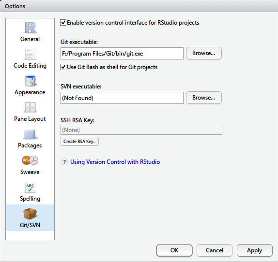

+ 安装 R
+ 安装 git
+ 安装 RStudio

设置 RStudio 中 git 的路径

新建一个 project（File -> New Project -> New Directory -> Empty Project），然后设置路径。

新建一个 repo，完成后然后根据 git 的提示进行设置：

+ 打开 git bash，设置 git 到 R project 的目录 
<pre class="lang:git decode:true " >
mkdir /path/to/your/project
cd /path/to/your/project
git init
git remote add origin git@bitbucket.org:EthanDeng/r-language.git
</pre>

git 的 commit 和 push
<pre class="lang:git decode:true " >
echo "Ethan Deng" >> contributors.txt
git add contributors.txt
git commit -m 'Initial commit with contributors'
git push -u origin master
</pre>

 
